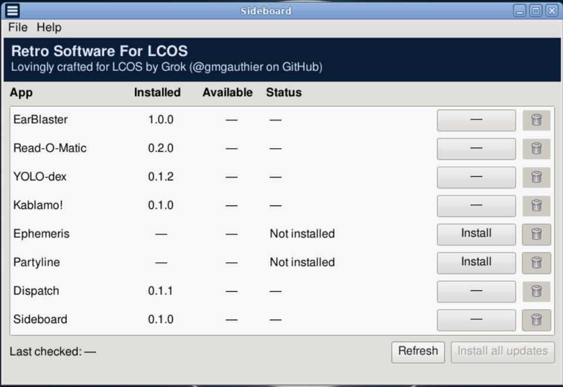

# Sideboard

**Vended by Grok Build**

Sideboard is a cabinet for the guest applications written for The Lunduke Computer Operating System. It is not an official LCOS updater and it is not a store. It lists EarBlaster, Read-O-Matic, YOLO-dex, Kablamo!, Ephemeris, Partyline, Dispatch, and itself; shows the version `dpkg` has versus the version on GitHub Releases; and installs the published `.deb`.

LCOS itself: [https://github.com/BryanLunduke/LCOS](https://github.com/BryanLunduke/LCOS)

Plan of record: [DEVELOPMENT.md](DEVELOPMENT.md). Current cut: **M4** — Debian package. See [INSTALL.md](INSTALL.md).

License: The Unlicense (`UNLICENSE`).
